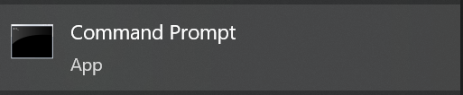
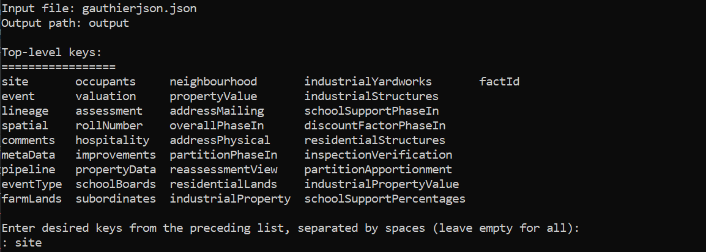
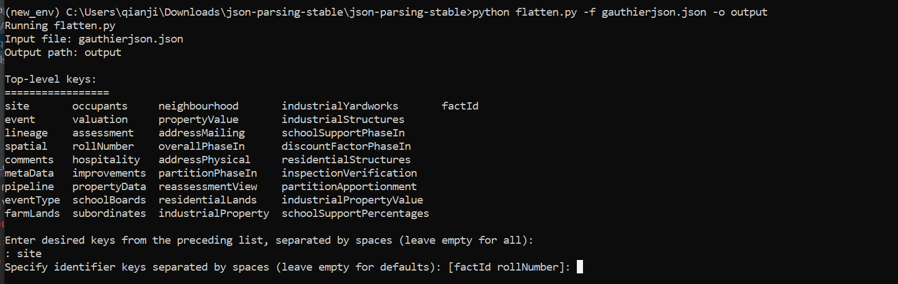
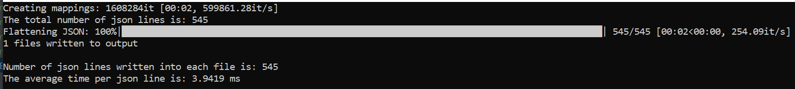

# json-parsing

## **Description**
The program will initially identify ALL
top-level keys (i.e. outermost keys) that 
are available within the input JSON file
unless otherwise specified by the user
(See Selected Tables). A CSV file will
be created and named after each of these
keys. This initial part of the program, 
called mappings, will also read the entire
JSON file to determine the required headers 
of the output CSV files. Next, the json will
be flattened and written to the CSV files,
skipping any top-level keys which were not
selected by the user. All values will be
written based on the previously created
mappings. This section also undertakes
the task of adding the identifiers to each CSV file (e.g. rollNumber, factId). 

## **Python Version Requirement**
Python 3.9 is required. Make sure PIP tool is installed in python. 

## **Installation** 

### _Command (cmd) Prompt_

1. Open command prompt
2. Check if python is installed in cmd. Type `python` or `py`. If python is installed it will show the version details. Otherwise, it will open MS Store. If python is not installed in cmd, please see the method using Anaconda.
3. Set the right directory path to the py files.

    `cd C:\Users\username\path`
4. Install required packages.

    `pip install -r requirements.txt`
5. Everything is set up now.

### _Anaconda Prompt (Anaconda3)_

1. Open Anaconda prompt
2. Create a new environment under python 3.9.12

    `conda create --name env_name python=3.9.12 pip`
3. Activate the new environment.

    `conda activate env_name`
4. Check if python is installed in the new environment. Type `python` or `py`. If python is installed it will show the version details. Otherwise, it will open MS Store. If python is not installed in cmd, please see the method using Anaconda.
5. Set the right directory path to the py files.

    `cd C:\Users\username\path`
6. Install required packages.

    `pip install -r requirements.txt`
7. Everything is set up now.

## **Usage**
After everything is installed properly. Type the command 
`python flatten.py -f input_file_name -o output_file_folder_name`

Then you will see the interactive result as below.

You can specify top-level keys. Type the
desired top-level keys* (separate them by space)
then press ENTER. If all the top-level keys are desired, just press ENTER. 
Then you will see the below.

You can then specify identifiers. Type the desired identifiers (separate them by space) then press ENTER. If all the identifiers are desired, just press ENTER.   

Wait for the process to complete.

The process ended after the progess reaches 100%. 

You can find the folder `'output_file_folder_name'` with all your desired csv files now.

_*: top-level keys are listed in the JSON Flattening Outline.docx_

## **Authors**

Sophia Nguyen, Thomas Cole, Jiachen Qian
