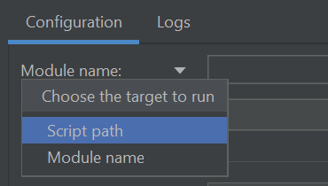

# json-parsing

## **Description**
The program will initially identify ALL
top-level keys (i.e. outermost keys) that 
are available within the input JSON file
unless otherwise specified by the user
(See Selected Tables). A CSV file will
be created and named after each of these
keys. This initial part of the program, 
called mappings, will also read the entire
JSON file to determine the required headers 
of the output CSV files. Next, the json will
be flattened and written to the CSV files,
skipping any top-level keys which were not
selected by the user. All values will be
written based on the previously created
mappings. This section also undertakes
the task of adding the identifiers to each CSV file. 

## **Python Version Requirement**
Python 3.9 is required. Make sure PIP tool is installed in python. 

## **Installation** 

### _Command (cmd) Prompt_
1. Open command prompt
2. Check if python is installed in cmd. Type `python` or `py`. If python is installed it will show the version details. Otherwise, it will open MS Store. If python is not installed in cmd, please see the method using Anaconda.
3. Set the right directory path to the py files.

    `cd C:\Users\username\path`
4. Install json parsing.

    `pip install .`
5. Everything is set up now. You can check if `json2tab` package is successfully installed in the environment.
   `where json2tab`

## **Usage : Convert JSON to multiple CSV files (Command line)**

Note: All the following commands also work this way:

   `python -m json2tab [OPTIONS]`

1. After everything is installed properly. Use the command

   `json2tab -f input_file_name -o output_file_folder_name`

   If you want the output files to be compressed, which save the space a lot. Use the command

   `json2tab -f input_file_name -o output_file_folder_name --compress`

2. Then all the available top-level keys are showed in the interactive result.

   You can specify top-level keys.
Type the desired top-level keys (separate them by space)
then press ENTER. If all the top-level keys are desired, just press ENTER.

3. Then you can specify identifiers. Type the desired identifiers (separate them by space) then press ENTER.
If no identifiers is desired, just press ENTER.

4. Wait for the process to complete.
The process ended after the progess reaches 100%. 

   You can find the folder `'output_file_folder_name'` with all your desired csv files now.

## **Usage : Convert JSON to multiple CSV files (Configuation)**
1. Open PyCharm.
2. Click the 'Add Configuration...' at the top right corner.
3. Add a python configuration. 
   1. Use Module name instead of Script path, fill it in with `json2tab`.
   
   2. Fill in the _Parameters_ with `-f input-file-path -o output-file-folder-path -t top-levl-key -id identifier --compress`*,
   remove `--compress` if you don't want the output files to be compressed.
   3. Select an environment with `json2tab` package installed in _Python interpreter_. 
   4. Fill in the _Working directory_ with the location you want the output file folder to be located.

   5. Click Apply. Here is an example.
   
4. Run it by selecting the configuration you want. 
   
## **Help**
Run the code in command line for more information, add a new _Command Prompt_ window under _Terminal_ if you are using PyCharm

`python -m json2tab --help`
